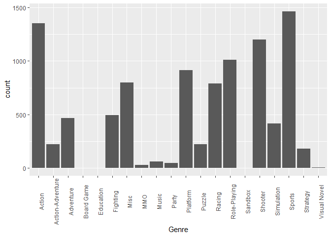
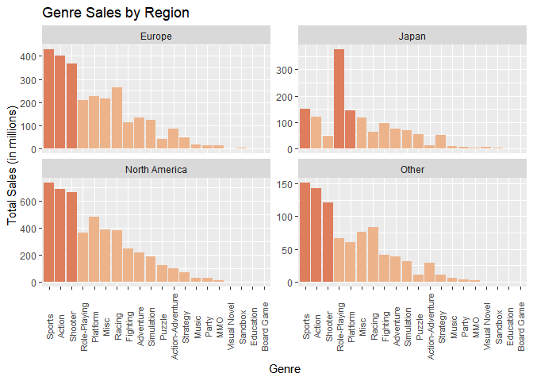
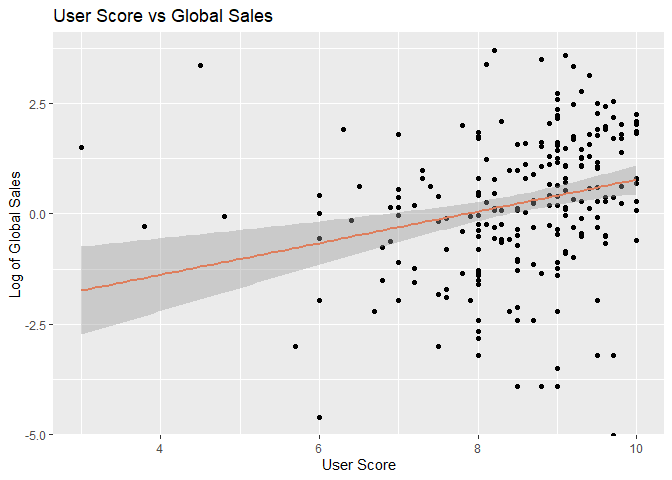
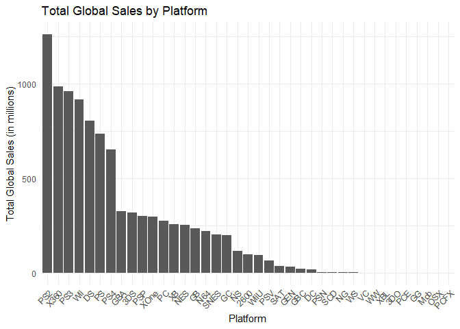

# Final Project: Video Game Sales

#### Analyn Seeman, Devon Katragadda, Cassidy Berghoff, and Sofi Gutierrez

## Introduction

Intro goes here – State the goal of the project

1.  Which genre has the best sales?

2.  Is there a relationship between user rating and sales? What about
    critic rating in sales? Which one would be better marker for a
    bestseller?

3.  Which platform had the most successful games?

4.  Which platform’s games have the best rating? Does platform affect
    the above questions?

5.  What is the most popular genre per platform?

… and so on

These are the main questions we are looking to answer throughout the
course of the final project. Using the results of the analysis, we will
draw a meaningful conclusion on XXX.

## Data

### Uploading Data Set

``` r
data = read.csv("Video Game Sales 1978 - 2024 export 2025-03-31 22-10-49.csv")

head(data)
```

    ##   Rank             Name Platform All_Platforms
    ## 1    1           Tetris   Series              
    ## 2    2          Pokemon   Series              
    ## 3    3     Call of Duty   Series              
    ## 4    4 Grand Theft Auto   Series              
    ## 5    5      Super Mario   Series              
    ## 6    6             FIFA   Series              
    ##                                                                                                                                                                                                                                                                                                                                                                                                                                                                                                                                                                                                                                                                                                                                                                                                                                                                                                                                                                                                                                                                                All_Games
    ## 1 Tetris (1984)|Tetris (1989)|Welltris|Hatris|Twintris|Super Twintris|Faces... Tris III|Super Tetris|Tetris 2 + Bombliss|Tetris 2|Tetris Battle Gaiden|Tetris & Dr. Mario|Super Tetris 3|V-Tetris|Tetris Blast|Tetris Attack|3D Tetris|Tetris S|Tetris Plus|Tetris Plus 2|Tetrsiphere|Tetris DX|Tetris 4D|Tetris 64|Tetris: The Grand Master|Kids Tetris|The New Tetris|The Next Tetris|Magical Tetris Challenge|Sega Tetris|Tetris: The Absolute - The Grand Master 2|Tetris With Cardcaptor Sakura: Eternal Heart|Tetris Worlds|Pokemon Tetris|Tetris Elements|Tetris: The Grand Master 3 - Terror Instinct|Tetris: The Grand Master Ace|Tetris Mania|Tetris DS|iPod Tetris|Tetris Evolution|Tetris Zone|Tetris Splash|Tetris Online Japan|Tetris Friends|Tetris Party|Tetris Pop|Tetris Giant|Tetris Party Deluxe|Tetris Party Live|Tetris Battle|Tetris (EA Games)|Tetris (EA Mobile)|Tetris: Axis|Tetris Stars|Tetris Blitz|Tetris (2013)|Puyo Puyo Tetris|Puyo Puyo Tetris S|Tetris (Amazon Fire)|Tetris Battle: Fusion|Tetris Ultimate|Tetris Effect|Tetris 99|Puyo Puyo Tetris 2
    ## 2                                                                                                                                                                                                                                                                                                                                                                                                                                                                                                                            Pokemon Red & Green (Japan-only) & Blue|Pokemon Yellow|Pokemon Gold & Silver|Pokemon Crystal|Pokemon Ruby & Sapphire|Pokemon FireRed & LeafGreen|Pokemon Emerald|Pokemon Diamond & Pearl|Pokemon Platinum|Pokemon HeartGold & SoulSilver|Pokemon Black & White|Pokemon Black 2 & White 2|Pokemon X & Y|Pokemon Omega Ruby & Alpha Sapphire|Pokemon Sun & Moon|Pokemon Ultra Sun & Ultra Moon|Pokemon: Let's Go Pikachu! & Let's Go Eevee!|Pokemon Sword & Shield|Pokemon Brilliant Diamond / Shining Pearl|Pokemon Legends: Arceus|Pokemon Scarlet / Violet
    ## 3                                         Call of Duty|Call of Duty 2|Call of Duty 3|Call of Duty 4: Modern Warfare|Call of Duty: World at War|Call of Duty: Modern Warfare 2|Call of Duty: Black Ops|Call of Duty: Modern Warfare 3|Call of Duty: Black Ops II|Call of Duty: Ghosts|Call of Duty: Advanced Warfare|Call of Duty: Black Ops III|Call of Duty: Infinite Warfare|Call of Duty: WWII|Call of Duty: Black Ops 4|Call of Duty: Modern Warfare (2019)|Call of Duty: Black Ops Cold War|Call of Duty: Vanguard|Call of Duty: Modern Warfare II|Call of Duty: Modern Warfare III|Call of Duty: Finest Hour|Call of Duty 2: Big Red One|Call of Duty: World at War - Final Fronts|Call of Duty: The War Collection|Call of Duty: Roads to Victory|Call of Duty: Modern Warfare: Mobilized|Call of Duty: Modern Warfare 2: Force Recon|Call of Duty: Black Ops DS|Call of Duty: Zombies and Zombies 2|Call of Duty: Black Ops: Decassified|Call of Duty: Strike Team|Call of Duty: Heroes|Call of Duty: Mobile|Call of Duty Online|Call of Duty: Warzone|Call of Duty: Warzone 2.0
    ## 4                                                                                                                                                                                                                                                                                                                                                                                                                                                                                                                                                                                                                                                                                                                                                           Grand Theft Auto|Grand Theft Auto: London 1969|Grand Theft Auto 2|Grand Theft Auto III|Grand Theft Auto: Vice City|Grand Theft Auto: San Andreas|Grand Theft Auto Advance|Grand Theft Auto: Liberty City Stories|Grand Theft Auto: Vice City Stories|Grand Theft Auto IV|Grand Theft Auto: Chinatown Wars|Grand Theft Auto V
    ## 5                                                               Mario Bros.|Super Mario Bros.|Super Mario Bros.: The Lost Levels|Super Mario Bros. 2|Super Mario Bros. 3|Super Mario Land|Super Mario World|Super Mario Land 2: 6 Golden Coins|Super Mario All-Stars|Super Mario Land 3: Wario Land|Super Mario World 2: Yoshi's Island|Super Mario 64|Super Mario Bros. Deluxe|Super Mario Advance|Super Mario Advance 2: Super Mario World|Super Mario Sunshine|Super Mario Advance 3: Yoshi's Island|Super Mario Advance 4: Super Mario Bros. 3|Classic NES Series: Super Mario Bros.|Super Mario 64 DS|New Super Mario Bros.|Super Mario Galaxy|New Super Mario Bros. Wii|Super Mario Galaxy 2|Super Mario All-Stars - 25th Anniversary Edition|Super Mario 3D Land|New Super Mario Bros. 2|New Super Mario Bros. U|New Super Luigi U|Super Mario 3D World|Super Mario Maker|Super Mario Run|Super Mario Maker for 3DS|Super Mario Odyssey|New Super Mario Bros. U Deluxe|Super Mario Maker 2|Super Mario 3D All Stars|Super Mario 3D World + Bowser's Fury|Super Mario Bros. Wonder
    ## 6                                                                                                                                                                                                                                                                                                                                        FIFA International Soccer|FIFA Soccer 95|FIFA Soccer 96|FIFA 97|FIFA 64|FIFA: Road to World Cup 98|FIFA 99|FIFA 2000|FIFA 2001|FIFA Football 2002|FIFA Football 2003|FIFA Football 2004|FIFA Football 2005|FIFA 06|FIFA 07|FIFA 08|FIFA 09|FIFA 10|FIFA 11|FIFA 12|FIFA 13|FIFA 14|FIFA 15|FIFA 16|FIFA 17|FIFA 18|FIFA 19|FIFA 20|FIFA 21|FIFA 22|FIFA 23|World Cup 98|2002 FIFA World Cup|2006 FIFA World Cup|2010 FIFA World Cup South Africa|2014 FIFA World Cup Brazil|UEFA Euro 2000|UEFA Euro 2004|UEFA Euro 2008|UEFA Euro 2012|UEFA Champions League 2004-2005|UEFA Champions League 2006-2007|FIFA Street|FIFA Street 2|FIFA Street 3|FIFA Street (2012)|FIFA Online|FIFA Online 2|FIFA Online 3|FIFA World|FIFA Mobile|FIFA Online 4
    ##              Publisher                               Developer Critic_Score
    ## 1 The Tetris Company                         Alexey Pajitnov             NA
    ## 2           Nintendo                              Game Freak             NA
    ## 3         Activision                           Infinity Ward             NA
    ## 4     Rockstar Games                          Rockstar North             NA
    ## 5           Nintendo                                Nintendo             NA
    ## 6          EA Sports   Extended Play Productions (1991-1997)             NA
    ##   User_Score NA_Sales PAL_Sales JP_Sales Other_Sales Global_Sales Year
    ## 1         NA       NA        NA       NA          NA           NA 1988
    ## 2         NA       NA        NA       NA          NA           NA 1998
    ## 3         NA       NA        NA       NA          NA           NA 2003
    ## 4         NA       NA        NA       NA          NA           NA 1998
    ## 5         NA       NA        NA       NA          NA           NA 1983
    ## 6         NA       NA        NA       NA          NA           NA 1993
    ##              Genre
    ## 1           Puzzle
    ## 2     Role-Playing
    ## 3          Shooter
    ## 4 Action-Adventure
    ## 5         Platform
    ## 6           Sports

``` r
# View(data)
```

``` r
library(dplyr)
```

    ## 
    ## Attaching package: 'dplyr'

    ## The following objects are masked from 'package:stats':
    ## 
    ##     filter, lag

    ## The following objects are masked from 'package:base':
    ## 
    ##     intersect, setdiff, setequal, union

``` r
library(tidyr)
```

    ## Warning: package 'tidyr' was built under R version 4.4.3

``` r
library(ggplot2)
```

### Description of Data Set

``` r
str(data)
```

    ## 'data.frame':    63927 obs. of  16 variables:
    ##  $ Rank         : int  1 2 3 4 5 6 7 8 9 10 ...
    ##  $ Name         : chr  "Tetris" "Pokemon" "Call of Duty" "Grand Theft Auto" ...
    ##  $ Platform     : chr  "Series" "Series" "Series" "Series" ...
    ##  $ All_Platforms: chr  "" "" "" "" ...
    ##  $ All_Games    : chr  "Tetris (1984)|Tetris (1989)|Welltris|Hatris|Twintris|Super Twintris|Faces... Tris III|Super Tetris|Tetris 2 + B"| __truncated__ "Pokemon Red & Green (Japan-only) & Blue|Pokemon Yellow|Pokemon Gold & Silver|Pokemon Crystal|Pokemon Ruby & Sap"| __truncated__ "Call of Duty|Call of Duty 2|Call of Duty 3|Call of Duty 4: Modern Warfare|Call of Duty: World at War|Call of Du"| __truncated__ "Grand Theft Auto|Grand Theft Auto: London 1969|Grand Theft Auto 2|Grand Theft Auto III|Grand Theft Auto: Vice C"| __truncated__ ...
    ##  $ Publisher    : chr  "The Tetris Company  " "Nintendo  " "Activision  " "Rockstar Games  " ...
    ##  $ Developer    : chr  "Alexey Pajitnov  " "Game Freak  " "Infinity Ward  " "Rockstar North  " ...
    ##  $ Critic_Score : num  NA NA NA NA NA NA NA NA NA NA ...
    ##  $ User_Score   : num  NA NA NA NA NA NA NA NA NA NA ...
    ##  $ NA_Sales     : num  NA NA NA NA NA NA NA NA NA NA ...
    ##  $ PAL_Sales    : num  NA NA NA NA NA NA NA NA NA NA ...
    ##  $ JP_Sales     : num  NA NA NA NA NA NA NA NA NA NA ...
    ##  $ Other_Sales  : num  NA NA NA NA NA NA NA NA NA NA ...
    ##  $ Global_Sales : num  NA NA NA NA NA NA NA NA NA NA ...
    ##  $ Year         : int  1988 1998 2003 1998 1983 1993 2011 2011 1997 2007 ...
    ##  $ Genre        : chr  "Puzzle" "Role-Playing" "Shooter" "Action-Adventure" ...

``` r
# View(data)
```

This data set compiles data from video game sales from 1978 to 2024.
There are 16 columns in this data set, representing the 16 variables in
the data set.

### Variables

- Rank: The index of the data set
- Name: The name of the game
- Platform: The platform that the game was released for
- All_Platforms: A variable that holds a “list” that describes which
  platforms a game is on if it is on multiple
- All_Games: A list of all of the games in that series
- Publisher: The publisher of the games
- Developer: The people that developed the game
- Critic_Score: What numeric value the critics gave the game (NA, 0-10)
- User_Score: What numeric value the users gave the game (NA, 0-10)
- NA_Sales: Sales in the North American region
- PAL_Sales: Sales in the European region
- JP_Sales: Sales in the Eastern Asia region
- Other_Sales: Sales in all other regions
- Global_Sales: Year: The year the game was released (if in a series,
  the year the most recent game was released)
- Genre: The genre of the game

### Cleaning of Data Set

``` r
q1_data <- data %>%
  drop_na(Global_Sales) #dropping games with no available Sale data

q2_data <- q1_data %>%
  drop_na(Critic_Score) %>%
  drop_na(User_Score) #dropping games with no available Sale data
```

## Marginal Summaries

``` r
q1_data %>%
  group_by(Platform) %>%
  summarise(maxSales = max(Global_Sales)) #3
```

    ## # A tibble: 39 × 2
    ##    Platform maxSales
    ##    <chr>       <dbl>
    ##  1 2600         7.81
    ##  2 3DO          0.09
    ##  3 3DS         16.1 
    ##  4 DC           2.42
    ##  5 DS          29.8 
    ##  6 GB          31.4 
    ##  7 GBA         15.8 
    ##  8 GBC          6.39
    ##  9 GC           7.07
    ## 10 GEN          6.03
    ## # ℹ 29 more rows

``` r
# Anything with critic ratings, user ratings, and sales data 
q2_data %>%
  group_by(Platform) %>%
  summarise(maxUserScore = max(User_Score), maxCriticScore = max(Critic_Score)) #4
```

    ## # A tibble: 18 × 3
    ##    Platform maxUserScore maxCriticScore
    ##    <chr>           <dbl>          <dbl>
    ##  1 3DS               9.3            8.9
    ##  2 DS                9.6            9.5
    ##  3 GC                9.5            9.6
    ##  4 N64              10              9.9
    ##  5 NES               8.2           10  
    ##  6 NS               10              9.9
    ##  7 PC                9.7            9.3
    ##  8 PS               10              9.7
    ##  9 PS2              10              9.6
    ## 10 PS3               9.8           10  
    ## 11 PS4              10              9.7
    ## 12 PSN               8.7            7.7
    ## 13 PSP              10              8.9
    ## 14 Wii              10              9.7
    ## 15 WiiU             10             10  
    ## 16 X360             10              9.6
    ## 17 XB               10              9.4
    ## 18 XOne              9              9

## Results

### Question 1: Which genre has the best sales?

``` r
q1_genre <- q1_data %>%
  group_by(Genre) %>%
  summarise(totalSales = sum(Global_Sales)) %>%
  arrange(desc(totalSales))

q1_genre
```

    ## # A tibble: 20 × 2
    ##    Genre            totalSales
    ##    <chr>                 <dbl>
    ##  1 Sports              1465.  
    ##  2 Action              1353.  
    ##  3 Shooter             1199.  
    ##  4 Role-Playing        1013.  
    ##  5 Platform             914.  
    ##  6 Misc                 799.  
    ##  7 Racing               789.  
    ##  8 Fighting             495.  
    ##  9 Adventure            465.  
    ## 10 Simulation           415.  
    ## 11 Puzzle               224.  
    ## 12 Action-Adventure     221.  
    ## 13 Strategy             180.  
    ## 14 Music                 62.7 
    ## 15 Party                 47.8 
    ## 16 MMO                   28.5 
    ## 17 Visual Novel           5.78
    ## 18 Sandbox                1.89
    ## 19 Education              0.97
    ## 20 Board Game             0.33

``` r
library(ggplot2)
ggplot(q1_genre, aes(x = Genre, weight= totalSales)) +
  geom_bar() +
  theme(axis.text.x = element_text(angle = 90))
```

<!-- -->

``` r
ggplot(data, aes(x = Year, y = log(Global_Sales), color = Critic_Score)) +
  geom_point()
```

    ## Warning: Removed 43710 rows containing missing values or values outside the scale range
    ## (`geom_point()`).

<!-- -->

### Question 2: Is there a relationship between user rating and sales? What about critic rating?

``` r
# Scatter plot for user score vs global sales
ggplot(q2_data, aes(x = User_Score, y = Global_Sales)) +
  geom_point() +
  geom_smooth(method = "lm", col = "blue") +
  labs(title = "User Score vs Global Sales", x = "User Score", y = "Global Sales")
```

    ## `geom_smooth()` using formula = 'y ~ x'

<!-- -->

``` r
# Scatter plot for critic score vs global sales
ggplot(q2_data, aes(x = Critic_Score, y = Global_Sales)) +
  geom_point() +
  geom_smooth(method = "lm", col = "red") +
  labs(title = "Critic Score vs Global Sales", x = "Critic Score", y = "Global Sales")
```

    ## `geom_smooth()` using formula = 'y ~ x'

<!-- -->

``` r
# These scatter plots will visually explore potential correlations between scores (user and critic) and sales. Regression lines provide insights into the strength and direction of the relationships.
```

### Question 3: Which platform had the most successful games?

``` r
q1_platform <- q1_data %>%
  group_by(Platform) %>%
  summarise(totalSales = sum(Global_Sales)) %>%
  arrange(desc(totalSales))

q1_platform
```

    ## # A tibble: 39 × 2
    ##    Platform totalSales
    ##    <chr>         <dbl>
    ##  1 PS2           1264.
    ##  2 X360           986.
    ##  3 PS3            959.
    ##  4 Wii            916.
    ##  5 DS             805.
    ##  6 PS             734.
    ##  7 PS4            652.
    ##  8 GBA            324.
    ##  9 3DS            319.
    ## 10 PSP            302.
    ## # ℹ 29 more rows

``` r
ggplot(q1_platform, 
       aes(
         x = reorder(Platform, -totalSales), 
         y = totalSales)
       ) +
  geom_bar(stat = "identity") +
  labs(title = "Total Global Sales by Platform",
       x = "Platform",
       y = "Total Global Sales (in millions)") +
  theme_minimal() +
  theme(axis.text.x = element_text(angle = 45, hjust = 1))
```

<!-- -->

``` r
# This will list the platforms ranked by total global sales. The platform with the highest total sales is deemed the most successful.
```

### Question 4: Which platform’s games have the best rating?

``` r
q2_platform <- q2_data %>%
  group_by(Platform) %>%
  summarise(
    avgUserScore = mean(User_Score, na.rm = TRUE),
    avgCriticScore = mean(Critic_Score, na.rm = TRUE)
  ) %>%
  arrange(desc(avgUserScore), desc(avgCriticScore))

q2_platform
```

    ## # A tibble: 18 × 3
    ##    Platform avgUserScore avgCriticScore
    ##    <chr>           <dbl>          <dbl>
    ##  1 N64              9.53           9.63
    ##  2 XB               9.37           9.3 
    ##  3 PS4              9              9.05
    ##  4 PSP              8.8            7.72
    ##  5 PS2              8.79           8.82
    ##  6 PS3              8.71           8.35
    ##  7 PSN              8.7            7.7 
    ##  8 NS               8.68           8.17
    ##  9 PC               8.6            8.3 
    ## 10 X360             8.58           8.26
    ## 11 DS               8.53           8.32
    ## 12 Wii              8.35           7.47
    ## 13 NES              8.2           10   
    ## 14 GC               8.2            7.85
    ## 15 XOne             8              7.95
    ## 16 PS               7.94           8.47
    ## 17 3DS              7.77           8.13
    ## 18 WiiU             7.44           7.48

``` r
# Platforms are ranked based on average user and critic scores. A high average score might indicate quality gaming experiences on that platform
```

## Conclusion

1.  The genre with the best sales is Sports, highlighting its popularity
    among players worldwide.

2.  There is a positive but not particularly strong relationship between
    both user and critic ratings and global sales. Higher scores
    generally align with better sales, but other variables clearly play
    a role. A moderate/strong relationship exists between critic ratings
    and global sales, suggesting their importance as a marker for
    potential bestsellers. This may indicate that critic ratings carry
    more weight or visibility in influencing purchasing decisions.

3.  The most successful platform in terms of global sales is PS2.

4.  XB is home to games with the best average ratings, solidifying its
    reputation for quality.
