# Final Project: Video Game Sales

#### Analyn Seeman, Devon Katragadda, Cassidy Berghoff, and Sofi Gutierrez

## Introduction

The video game industry is one of the largest and fastest-growing
entertainment sectors in the world, engaging audiences across the world.
With the rise of digital distribution platforms, online reviews, and
global gaming communities, understanding what contributes to a video
game’s commercial and critical success has become more relevant than
ever for developers, publishers, and marketers alike.

This project aims to explore the factors that define a successful video
game by analyzing historical data across multiple categories such as
sales, ratings, platforms, genres, and geographic trends. By examining
these attributes, we hope to identify patterns and correlations that can
offer insights into consumer preferences and industry dynamics.

To guide our analysis, we focus on the following research questions:

1.  Which genre has the best sales?

2.  Is there a relationship between user rating and sales? What about
    critic rating in sales? Which one would be better marker for a
    bestseller?

3.  Which platform had the most successful games?

4.  Which platform’s games have the best rating? Does platform affect
    the above questions?

5.  What is the most popular genre per platform?

6.  What years were most successful for video games

7.  During the best years, which genres were most popular?

8.  What is the most popular genre by area?

By answering these questions, we aim to identify key trends that
influence the success of a video game. The insights gained from this
analysis can help video game developers find the best chance of success
in the gaming industry.

## Data

### Uploading Data Set

``` r
data = read.csv("Video Game Sales 1978 - 2024 export 2025-03-31 22-10-49.csv")

head(data)
```

    ##   Rank             Name Platform All_Platforms
    ## 1    1           Tetris   Series              
    ## 2    2          Pokemon   Series              
    ## 3    3     Call of Duty   Series              
    ## 4    4 Grand Theft Auto   Series              
    ## 5    5      Super Mario   Series              
    ## 6    6             FIFA   Series              
    ##                                                                                                                                                                                                                                                                                                                                                                                                                                                                                                                                                                                                                                                                                                                                                                                                                                                                                                                                                                                                                                                                                All_Games
    ## 1 Tetris (1984)|Tetris (1989)|Welltris|Hatris|Twintris|Super Twintris|Faces... Tris III|Super Tetris|Tetris 2 + Bombliss|Tetris 2|Tetris Battle Gaiden|Tetris & Dr. Mario|Super Tetris 3|V-Tetris|Tetris Blast|Tetris Attack|3D Tetris|Tetris S|Tetris Plus|Tetris Plus 2|Tetrsiphere|Tetris DX|Tetris 4D|Tetris 64|Tetris: The Grand Master|Kids Tetris|The New Tetris|The Next Tetris|Magical Tetris Challenge|Sega Tetris|Tetris: The Absolute - The Grand Master 2|Tetris With Cardcaptor Sakura: Eternal Heart|Tetris Worlds|Pokemon Tetris|Tetris Elements|Tetris: The Grand Master 3 - Terror Instinct|Tetris: The Grand Master Ace|Tetris Mania|Tetris DS|iPod Tetris|Tetris Evolution|Tetris Zone|Tetris Splash|Tetris Online Japan|Tetris Friends|Tetris Party|Tetris Pop|Tetris Giant|Tetris Party Deluxe|Tetris Party Live|Tetris Battle|Tetris (EA Games)|Tetris (EA Mobile)|Tetris: Axis|Tetris Stars|Tetris Blitz|Tetris (2013)|Puyo Puyo Tetris|Puyo Puyo Tetris S|Tetris (Amazon Fire)|Tetris Battle: Fusion|Tetris Ultimate|Tetris Effect|Tetris 99|Puyo Puyo Tetris 2
    ## 2                                                                                                                                                                                                                                                                                                                                                                                                                                                                                                                            Pokemon Red & Green (Japan-only) & Blue|Pokemon Yellow|Pokemon Gold & Silver|Pokemon Crystal|Pokemon Ruby & Sapphire|Pokemon FireRed & LeafGreen|Pokemon Emerald|Pokemon Diamond & Pearl|Pokemon Platinum|Pokemon HeartGold & SoulSilver|Pokemon Black & White|Pokemon Black 2 & White 2|Pokemon X & Y|Pokemon Omega Ruby & Alpha Sapphire|Pokemon Sun & Moon|Pokemon Ultra Sun & Ultra Moon|Pokemon: Let's Go Pikachu! & Let's Go Eevee!|Pokemon Sword & Shield|Pokemon Brilliant Diamond / Shining Pearl|Pokemon Legends: Arceus|Pokemon Scarlet / Violet
    ## 3                                         Call of Duty|Call of Duty 2|Call of Duty 3|Call of Duty 4: Modern Warfare|Call of Duty: World at War|Call of Duty: Modern Warfare 2|Call of Duty: Black Ops|Call of Duty: Modern Warfare 3|Call of Duty: Black Ops II|Call of Duty: Ghosts|Call of Duty: Advanced Warfare|Call of Duty: Black Ops III|Call of Duty: Infinite Warfare|Call of Duty: WWII|Call of Duty: Black Ops 4|Call of Duty: Modern Warfare (2019)|Call of Duty: Black Ops Cold War|Call of Duty: Vanguard|Call of Duty: Modern Warfare II|Call of Duty: Modern Warfare III|Call of Duty: Finest Hour|Call of Duty 2: Big Red One|Call of Duty: World at War - Final Fronts|Call of Duty: The War Collection|Call of Duty: Roads to Victory|Call of Duty: Modern Warfare: Mobilized|Call of Duty: Modern Warfare 2: Force Recon|Call of Duty: Black Ops DS|Call of Duty: Zombies and Zombies 2|Call of Duty: Black Ops: Decassified|Call of Duty: Strike Team|Call of Duty: Heroes|Call of Duty: Mobile|Call of Duty Online|Call of Duty: Warzone|Call of Duty: Warzone 2.0
    ## 4                                                                                                                                                                                                                                                                                                                                                                                                                                                                                                                                                                                                                                                                                                                                                           Grand Theft Auto|Grand Theft Auto: London 1969|Grand Theft Auto 2|Grand Theft Auto III|Grand Theft Auto: Vice City|Grand Theft Auto: San Andreas|Grand Theft Auto Advance|Grand Theft Auto: Liberty City Stories|Grand Theft Auto: Vice City Stories|Grand Theft Auto IV|Grand Theft Auto: Chinatown Wars|Grand Theft Auto V
    ## 5                                                               Mario Bros.|Super Mario Bros.|Super Mario Bros.: The Lost Levels|Super Mario Bros. 2|Super Mario Bros. 3|Super Mario Land|Super Mario World|Super Mario Land 2: 6 Golden Coins|Super Mario All-Stars|Super Mario Land 3: Wario Land|Super Mario World 2: Yoshi's Island|Super Mario 64|Super Mario Bros. Deluxe|Super Mario Advance|Super Mario Advance 2: Super Mario World|Super Mario Sunshine|Super Mario Advance 3: Yoshi's Island|Super Mario Advance 4: Super Mario Bros. 3|Classic NES Series: Super Mario Bros.|Super Mario 64 DS|New Super Mario Bros.|Super Mario Galaxy|New Super Mario Bros. Wii|Super Mario Galaxy 2|Super Mario All-Stars - 25th Anniversary Edition|Super Mario 3D Land|New Super Mario Bros. 2|New Super Mario Bros. U|New Super Luigi U|Super Mario 3D World|Super Mario Maker|Super Mario Run|Super Mario Maker for 3DS|Super Mario Odyssey|New Super Mario Bros. U Deluxe|Super Mario Maker 2|Super Mario 3D All Stars|Super Mario 3D World + Bowser's Fury|Super Mario Bros. Wonder
    ## 6                                                                                                                                                                                                                                                                                                                                        FIFA International Soccer|FIFA Soccer 95|FIFA Soccer 96|FIFA 97|FIFA 64|FIFA: Road to World Cup 98|FIFA 99|FIFA 2000|FIFA 2001|FIFA Football 2002|FIFA Football 2003|FIFA Football 2004|FIFA Football 2005|FIFA 06|FIFA 07|FIFA 08|FIFA 09|FIFA 10|FIFA 11|FIFA 12|FIFA 13|FIFA 14|FIFA 15|FIFA 16|FIFA 17|FIFA 18|FIFA 19|FIFA 20|FIFA 21|FIFA 22|FIFA 23|World Cup 98|2002 FIFA World Cup|2006 FIFA World Cup|2010 FIFA World Cup South Africa|2014 FIFA World Cup Brazil|UEFA Euro 2000|UEFA Euro 2004|UEFA Euro 2008|UEFA Euro 2012|UEFA Champions League 2004-2005|UEFA Champions League 2006-2007|FIFA Street|FIFA Street 2|FIFA Street 3|FIFA Street (2012)|FIFA Online|FIFA Online 2|FIFA Online 3|FIFA World|FIFA Mobile|FIFA Online 4
    ##              Publisher                               Developer Critic_Score
    ## 1 The Tetris Company                         Alexey Pajitnov             NA
    ## 2           Nintendo                              Game Freak             NA
    ## 3         Activision                           Infinity Ward             NA
    ## 4     Rockstar Games                          Rockstar North             NA
    ## 5           Nintendo                                Nintendo             NA
    ## 6          EA Sports   Extended Play Productions (1991-1997)             NA
    ##   User_Score NA_Sales PAL_Sales JP_Sales Other_Sales Global_Sales Year
    ## 1         NA       NA        NA       NA          NA           NA 1988
    ## 2         NA       NA        NA       NA          NA           NA 1998
    ## 3         NA       NA        NA       NA          NA           NA 2003
    ## 4         NA       NA        NA       NA          NA           NA 1998
    ## 5         NA       NA        NA       NA          NA           NA 1983
    ## 6         NA       NA        NA       NA          NA           NA 1993
    ##              Genre
    ## 1           Puzzle
    ## 2     Role-Playing
    ## 3          Shooter
    ## 4 Action-Adventure
    ## 5         Platform
    ## 6           Sports

### Adding the libraries needed

``` r
library(dplyr)
```

    ## Warning: package 'dplyr' was built under R version 4.4.3

    ## 
    ## Attaching package: 'dplyr'

    ## The following objects are masked from 'package:stats':
    ## 
    ##     filter, lag

    ## The following objects are masked from 'package:base':
    ## 
    ##     intersect, setdiff, setequal, union

``` r
library(tidyr)
```

    ## Warning: package 'tidyr' was built under R version 4.4.3

``` r
library(ggplot2)
```

### Description of Data Set

``` r
str(data)
```

    ## 'data.frame':    63927 obs. of  16 variables:
    ##  $ Rank         : int  1 2 3 4 5 6 7 8 9 10 ...
    ##  $ Name         : chr  "Tetris" "Pokemon" "Call of Duty" "Grand Theft Auto" ...
    ##  $ Platform     : chr  "Series" "Series" "Series" "Series" ...
    ##  $ All_Platforms: chr  "" "" "" "" ...
    ##  $ All_Games    : chr  "Tetris (1984)|Tetris (1989)|Welltris|Hatris|Twintris|Super Twintris|Faces... Tris III|Super Tetris|Tetris 2 + B"| __truncated__ "Pokemon Red & Green (Japan-only) & Blue|Pokemon Yellow|Pokemon Gold & Silver|Pokemon Crystal|Pokemon Ruby & Sap"| __truncated__ "Call of Duty|Call of Duty 2|Call of Duty 3|Call of Duty 4: Modern Warfare|Call of Duty: World at War|Call of Du"| __truncated__ "Grand Theft Auto|Grand Theft Auto: London 1969|Grand Theft Auto 2|Grand Theft Auto III|Grand Theft Auto: Vice C"| __truncated__ ...
    ##  $ Publisher    : chr  "The Tetris Company  " "Nintendo  " "Activision  " "Rockstar Games  " ...
    ##  $ Developer    : chr  "Alexey Pajitnov  " "Game Freak  " "Infinity Ward  " "Rockstar North  " ...
    ##  $ Critic_Score : num  NA NA NA NA NA NA NA NA NA NA ...
    ##  $ User_Score   : num  NA NA NA NA NA NA NA NA NA NA ...
    ##  $ NA_Sales     : num  NA NA NA NA NA NA NA NA NA NA ...
    ##  $ PAL_Sales    : num  NA NA NA NA NA NA NA NA NA NA ...
    ##  $ JP_Sales     : num  NA NA NA NA NA NA NA NA NA NA ...
    ##  $ Other_Sales  : num  NA NA NA NA NA NA NA NA NA NA ...
    ##  $ Global_Sales : num  NA NA NA NA NA NA NA NA NA NA ...
    ##  $ Year         : int  1988 1998 2003 1998 1983 1993 2011 2011 1997 2007 ...
    ##  $ Genre        : chr  "Puzzle" "Role-Playing" "Shooter" "Action-Adventure" ...

This data set compiles data from video game sales from 1978 to 2024.
There are 16 columns in this data set, representing the 16 variables in
the data set.

### Variables

- Rank: The index of the data set
- Name: The name of the game
- Platform: The platform that the game was released for
- All_Platforms: A variable that holds a “list” that describes which
  platforms a game is on if it is on multiple
- All_Games: A list of all of the games in that series
- Publisher: The publisher of the games
- Developer: The people that developed the game
- Critic_Score: What numeric value the critics gave the game (NA, 0-10)
- User_Score: What numeric value the users gave the game (NA, 0-10)
- NA_Sales: Sales in the North American region
- PAL_Sales: Sales in the European region
- JP_Sales: Sales in the Eastern Asia region
- Other_Sales: Sales in all other regions
- Global_Sales: Year: The year the game was released (if in a series,
  the year the most recent game was released)
- Genre: The genre of the game

### Cleaning of Data Set

``` r
q1_data <- data %>%
  drop_na(Global_Sales) #dropping games with no available Sale data

q2_data <- q1_data %>%
  drop_na(Critic_Score) %>%
  drop_na(User_Score)   #dropping games with no available Sale data
```

### Marginal Summaries

``` r
q1_data %>%
  group_by(Platform) %>%
  summarise(maxSales = max(Global_Sales)) #3
```

    ## # A tibble: 39 × 2
    ##    Platform maxSales
    ##    <chr>       <dbl>
    ##  1 2600         7.81
    ##  2 3DO          0.09
    ##  3 3DS         16.1 
    ##  4 DC           2.42
    ##  5 DS          29.8 
    ##  6 GB          31.4 
    ##  7 GBA         15.8 
    ##  8 GBC          6.39
    ##  9 GC           7.07
    ## 10 GEN          6.03
    ## # ℹ 29 more rows

``` r
# Anything with critic ratings, user ratings, and sales data 
q2_data %>%
  group_by(Platform) %>%
  summarise(maxUserScore = max(User_Score), maxCriticScore = max(Critic_Score))
```

    ## # A tibble: 18 × 3
    ##    Platform maxUserScore maxCriticScore
    ##    <chr>           <dbl>          <dbl>
    ##  1 3DS               9.3            8.9
    ##  2 DS                9.6            9.5
    ##  3 GC                9.5            9.6
    ##  4 N64              10              9.9
    ##  5 NES               8.2           10  
    ##  6 NS               10              9.9
    ##  7 PC                9.7            9.3
    ##  8 PS               10              9.7
    ##  9 PS2              10              9.6
    ## 10 PS3               9.8           10  
    ## 11 PS4              10              9.7
    ## 12 PSN               8.7            7.7
    ## 13 PSP              10              8.9
    ## 14 Wii              10              9.7
    ## 15 WiiU             10             10  
    ## 16 X360             10              9.6
    ## 17 XB               10              9.4
    ## 18 XOne              9              9

## Results

### Going into Genres

``` r
q1_genre <- q1_data %>%
  group_by(Genre) %>%
  summarise(totalSales = sum(Global_Sales)) %>%
  arrange(desc(totalSales))

q1_genre
```

    ## # A tibble: 20 × 2
    ##    Genre            totalSales
    ##    <chr>                 <dbl>
    ##  1 Sports              1465.  
    ##  2 Action              1353.  
    ##  3 Shooter             1199.  
    ##  4 Role-Playing        1013.  
    ##  5 Platform             914.  
    ##  6 Misc                 799.  
    ##  7 Racing               789.  
    ##  8 Fighting             495.  
    ##  9 Adventure            465.  
    ## 10 Simulation           415.  
    ## 11 Puzzle               224.  
    ## 12 Action-Adventure     221.  
    ## 13 Strategy             180.  
    ## 14 Music                 62.7 
    ## 15 Party                 47.8 
    ## 16 MMO                   28.5 
    ## 17 Visual Novel           5.78
    ## 18 Sandbox                1.89
    ## 19 Education              0.97
    ## 20 Board Game             0.33

#### Which Genre is the Most Popular?

``` r
highlight_colors <- c(
  "yes" = "#de7e5d",    # Pastel red
  "no"  = "#edb48c"     # Pastel peach
)

q1_data %>%
  mutate(highlight = if_else(Genre %in% c("Sports", "Action", "Shooter"), "yes", "no")) %>%
  group_by(Genre, highlight) %>%
  summarise(total_sales = sum(Global_Sales, na.rm = TRUE), .groups = "drop") %>%
  ggplot(aes(x = reorder(Genre, -total_sales), y = total_sales, fill = highlight)) +
  geom_bar(stat = "identity", show.legend = FALSE) +
  scale_fill_manual(values = highlight_colors) +
  theme_minimal() +
  theme(axis.text.x = element_text(angle = 90)) +
  xlab("Genre") +
  ylab("Total Sales (in millions)") +
  ggtitle("Global Sales by Genre")
```

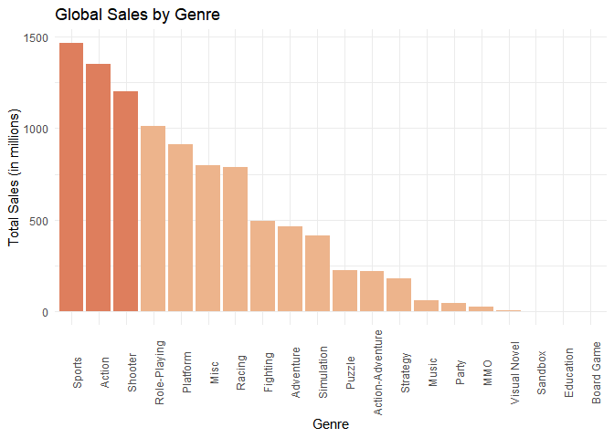<!-- -->

The above table shows the total global sales per video game genre. It is
sorted in decreasing order, meaning the most popular genre is located in
the top row. The genre with the highest total sales indicates the most
popular genre globally. Since Sports has the highest totalSale value, it
is the most popular genre globally, followed by Action and Shooter.

#### Which Genre is the Most Popular in Each Region?

``` r
genre_reigon_sales <- q1_data %>%
  group_by(Genre) %>%
  summarise(
    NA_Sales = sum(NA_Sales, na.rm = TRUE),
    PAL_Sales = sum(PAL_Sales, na.rm = TRUE),
    JP_Sales = sum(JP_Sales, na.rm = TRUE),
    Other_Sales = sum(Other_Sales, na.rm = TRUE)
  ) %>%
  pivot_longer(
    cols = c(NA_Sales, PAL_Sales, JP_Sales, Other_Sales),
    names_to = "Region",
    values_to = "Sales"
  ) %>%
  mutate(
    Region = recode(Region,
                    "NA_Sales" = "North America",
                    "PAL_Sales" = "Europe",
                    "JP_Sales" = "Japan",
                    "Other_Sales" = "Other"),
    highlight = if_else(
      ((Region == "Japan" & (Genre %in% c("Role-Playing", "Platform", "Sports"))) |
         (Region != "Japan" & (Genre %in% c("Sports", "Action", "Shooter")))
         ),"yes", "no" )
  )

highlight_colors <- c(
  "yes"  = "#de7e5d",    # Pastel red
  "no"      = "#edb48c"  # Pastel blue
)


ggplot(genre_reigon_sales, aes(reorder(Genre, -Sales), y = Sales, fill = highlight)) +
  geom_col(show.legend = FALSE) +
  theme(axis.text.x = element_text(size = 8, angle = 90, vjust=0.5)) + 
  scale_fill_manual(values = highlight_colors) +
  facet_wrap(~ Region, scales = "free_y") +
  labs(
    title = "Genre Sales by Region",
    x = "Genre",
    y = "Total Sales (in millions)"
  ) 
```

<!-- -->

All areas except for Japan have the same Top 3 Genres (Sports, Action,
Shooting). Japan however, has Role-Playing, Platforming, and Sports as
their top 3. Japan is a capital of video gaming. According to IMDb,
there exists a genre titled JRPG - or Japanese Role Playing Games. This
sub-genre contains popular titles such as Final Fantasy, Kingdom Hearts,
and Persona 5. While those titles are popular even in the US, they are
obviously extremely popular in Japanese culture given that they are in
the sub-genre named after it. Source:
<https://www.imdb.com/list/ls022397153/>

#### How does Average Sales affect Popular Genres?

``` r
highlight_colors <- c(
  "yes" = "#de7e5d",    # Pastel red
  "no"  = "#edb48c"     # Pastel peach
)

# Compute average sales per genre with highlight
avg_sales_by_genre <- q1_data %>%
  mutate(highlight = if_else(Genre %in% c("Sandbox", "Party", "Platform"), "yes", "no")) %>%
  group_by(Genre, highlight) %>%
  summarise(avg_sales = mean(Global_Sales, na.rm = TRUE), .groups = "drop")

# Plot with genres ordered by average sales
ggplot(avg_sales_by_genre, aes(x = reorder(Genre, -avg_sales), y = avg_sales, fill = highlight)) +
  geom_col(show.legend = FALSE) +
  scale_fill_manual(values = highlight_colors) +
  theme_minimal() +
  theme(axis.text.x = element_text(angle = 90)) +
  xlab("Genre") +
  ylab("Average Sales (in millions)") +
  ggtitle("Average Sales by Genre")
```

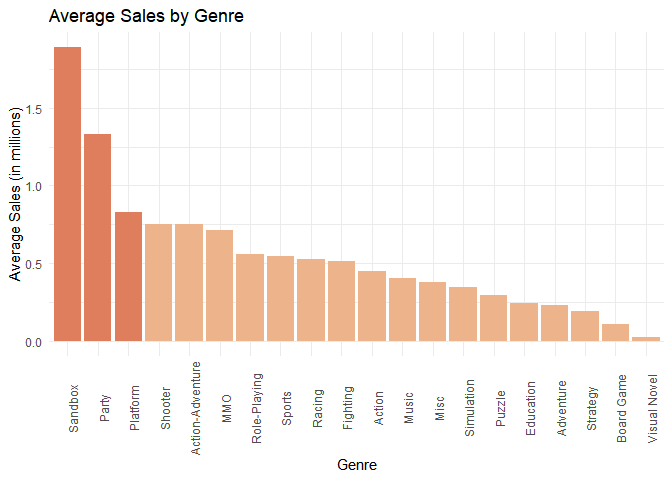<!-- --> This shows
that the average is different than the total. The top 3 genres for
average sales is Sandbox, Party, and Platform. This implies that while
Shooter games bring in the most total money, that there are a lot of
them and the genre is oversaturated. Sandbox games are the ones that
consistently perform better per game.

``` r
avg_sales_by_genre_by_year <- q1_data %>%
  mutate(highlight = if_else(Genre %in% c("Sandbox", "Party", "Platform"), "yes", "no")) %>%
  group_by(Genre, highlight, Year) %>%
  summarise(avg_sales = mean(Global_Sales, na.rm = TRUE), .groups = "drop")


avg_sales_by_genre_by_year %>%
  filter(Year > 2000) %>%
  ggplot(aes(x = Year, y = avg_sales)) +
  geom_col() +
  facet_wrap(~Genre) +
  labs(
    title = "Average Genre Sales by Year (After 2000)",
    x = "Year",
    y = "Global Sales (in millions)"
  ) +
  theme(
    axis.text.x = element_text(angle = 45, hjust = 1),
    axis.title.x = element_text(margin = margin(t = 10))
  ) +
  scale_y_continuous(labels = scales::comma)
```

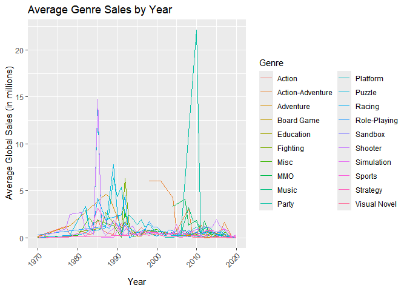<!-- -->

### Going into User and Critic Scores

#### Do User and Critic Ratings Differ?

``` r
# Histogram: Distribution of Critic Scores
ggplot(q2_data, aes(x = Critic_Score)) +
  geom_histogram(show.legend = FALSE, binwidth = 1, fill = "#edb48c") +
  labs(title = "Distribution of Critic Score", x = "Critic Score", y = "Count") + 
  scale_x_continuous(breaks = seq(0, 10, by = 1), limits = c(0,11)) + 
  ylim(0,100)
```

    ## Warning: Removed 2 rows containing missing values or values outside the scale range
    ## (`geom_bar()`).

<!-- -->

``` r
# Histogram: Distribution of User Scores
ggplot(q2_data, aes(x = User_Score)) +
  geom_histogram(show.legend = FALSE, binwidth = 1, fill = "#edb48c") +
  labs(title = "Distribution of User Score", x = "User Score", y = "Count") +
  scale_x_continuous(breaks = seq(0, 10, by = 1), limits = c(0,11)) + 
  ylim(0,100)
```

    ## Warning: Removed 2 rows containing missing values or values outside the scale range
    ## (`geom_bar()`).

<!-- -->

The distribution of user scores are Left Skewed with an average of
8.54185. While critic scores are less (still left) skewed than user
scores. With an average of 8.162555. This implies that critics are
actually more critical than users as they rate the games lower.

``` r
# Summary Statistics: Mean and Standard Deviation for Scores
q2_data %>%
  summarise(
    avgCS = mean(Critic_Score), 
    sdCs = sd(Critic_Score), 
    avgUS = mean(User_Score), 
    sdUs = sd(User_Score)
  )
```

    ##      avgCS     sdCs   avgUS     sdUs
    ## 1 8.162555 1.172003 8.54185 1.127281

#### Do Scores Differ Between Users and Critics?

``` r
# Scatter Plot: Critic Score vs User Score
ggplot(q2_data, aes(x = Critic_Score, y = User_Score)) +
  geom_point() +
  labs(title = "Critic Score vs User Score", x = "Critic Score", y = "User Score")
```

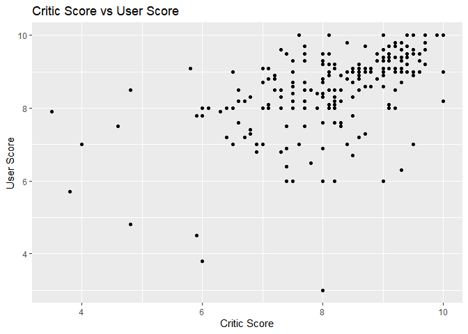<!-- -->

There is definitely a correlation between Critic Score and User Score,
but there is a notable difference as the scores get lower.

#### Do Ratings Influence Sales?

``` r
# Scatter plot for user score vs global sales
ggplot(q2_data, aes(x = User_Score, y = Global_Sales)) +
  geom_point() +
  geom_smooth(method = "lm", col = "blue") +
  labs(title = "User Score vs Global Sales", x = "User Score", y = "Global Sales")
```

    ## `geom_smooth()` using formula = 'y ~ x'

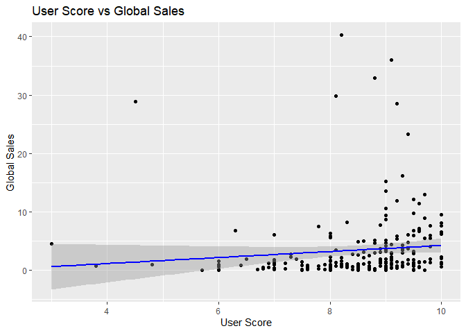<!-- -->

``` r
# Scatter plot for user score vs log global sales
ggplot(q2_data, aes(x = User_Score, y = log(Global_Sales))) +
  geom_point() +
  geom_smooth(method = "lm", col = "#de7e5d") +
  labs(title = "User Score vs Log Global Sales", x = "User Score", y = "Log of Global Sales")
```

    ## `geom_smooth()` using formula = 'y ~ x'

    ## Warning: Removed 1 row containing non-finite outside the scale range
    ## (`stat_smooth()`).

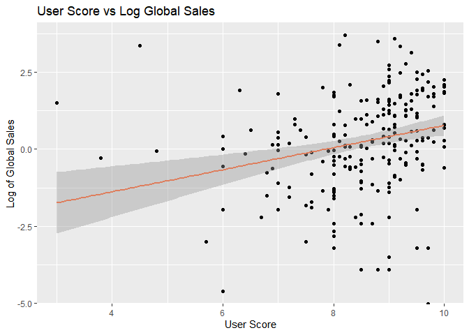<!-- -->

``` r
# Scatter plot for critic score vs global sales
ggplot(q2_data, aes(x = Critic_Score, y = Global_Sales)) +
  geom_point() +
  geom_smooth(method = "lm", col = "red") +
  labs(title = "Critic Score vs Global Sales", x = "Critic Score", y = "Global Sales")
```

    ## `geom_smooth()` using formula = 'y ~ x'

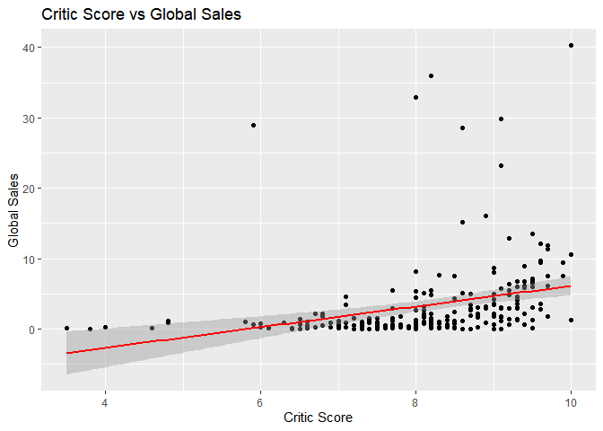<!-- -->

``` r
# Scatter plot for critic score vs log global sales
ggplot(q2_data, aes(x = Critic_Score, y = log(Global_Sales))) +
  geom_point() +
  geom_smooth(method = "lm", col = "#de7e5d") +
  labs(title = "Critic Score vs Log Global Sales", x = "Critic Score", y = "Log of Global Sales")
```

    ## `geom_smooth()` using formula = 'y ~ x'

    ## Warning: Removed 1 row containing non-finite outside the scale range
    ## (`stat_smooth()`).

<!-- -->

There is a very apparent log linear relationship between Sales and User
Score. Critic reviews may hold more weight in shaping purchasing
decisions because Less Deviance

#### Do Scores Differ by Platform?

``` r
q2_platform <- q2_data %>%
  group_by(Platform) %>%
  summarise(
    `Average User Score` = mean(User_Score, na.rm = TRUE),
    `Average Critic Score` = mean(Critic_Score, na.rm = TRUE)
  ) %>%
  arrange(desc(`Average User Score`), desc(`Average Critic Score`))

q2_platform
```

    ## # A tibble: 18 × 3
    ##    Platform `Average User Score` `Average Critic Score`
    ##    <chr>                   <dbl>                  <dbl>
    ##  1 N64                      9.53                   9.63
    ##  2 XB                       9.37                   9.3 
    ##  3 PS4                      9                      9.05
    ##  4 PSP                      8.8                    7.72
    ##  5 PS2                      8.79                   8.82
    ##  6 PS3                      8.71                   8.35
    ##  7 PSN                      8.7                    7.7 
    ##  8 NS                       8.68                   8.17
    ##  9 PC                       8.6                    8.3 
    ## 10 X360                     8.58                   8.26
    ## 11 DS                       8.53                   8.32
    ## 12 Wii                      8.35                   7.47
    ## 13 NES                      8.2                   10   
    ## 14 GC                       8.2                    7.85
    ## 15 XOne                     8                      7.95
    ## 16 PS                       7.94                   8.47
    ## 17 3DS                      7.77                   8.13
    ## 18 WiiU                     7.44                   7.48

The Scores do differ by platform, but we noticed that there are more
apparent patterns between Platform and Sales.

### Going into Platform

#### Which Platform Had the Best Selling Games?

``` r
# Add Company column to high_sales_platforms
high_sales_platforms <- q1_data %>%
  filter(
         Platform %in% c("N64", "XB", "PS4", "PSP", "PS2", "PS3", "PSN", 
                         "NS", "PC", "X360", "DS", "Wii", "NES", "GC", 
                         "XOne", "PS")) %>%
  mutate(
    Company = case_when(
      Platform %in% c("N64", "NS", "Wii", "DS", "NES", "GC") ~ "Nintendo",
      Platform %in% c("PS", "PS2", "PS3", "PS4", "PSP", "PSN") ~ "Sony",
      Platform %in% c("XB", "X360", "XOne") ~ "Microsoft",
      Platform == "PC" ~ "PC"
    )
  )

high_sales_platforms$Company = as.factor(high_sales_platforms$Company)


# Define custom color mapping
company_colors <- c(
  "Nintendo"  = "#F4A6A6",  # Pastel red
  "Sony"      = "#A6B8E6",  # Pastel blue
  "Microsoft" = "#A9D6A4",  # Pastel green
  "PC"        = "#C0C0C0"   # Light gray
)


# Plot with custom colors
ggplot(high_sales_platforms, aes(x = reorder(Platform, desc(Company)), y = log(Global_Sales), fill = Company)) +
  geom_boxplot(outlier.color = "red") +
  scale_fill_manual(values = company_colors) +
  labs(
    title = "Distribution of Global Sales by Platform",
    x = "Platform",
    y = "Global Sales (in millions)",
    fill = "Platform Brand"
  ) +
  theme_minimal() +
  theme(
    axis.text.x = element_text(angle = 45, hjust = 1),
    plot.title = element_text(face = "bold", size = 14)
  )
```

    ## Warning: Removed 1250 rows containing non-finite outside the scale range
    ## (`stat_boxplot()`).

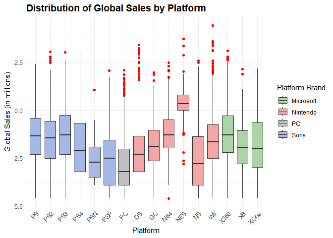<!-- -->

We’re looking at the distribution of global sales across gaming
platforms. Each box represents a platform, and it shows how game sales
are spread out, from lower-performing titles to hits. If we look at the
distribution, we’ll notice that Nintendo platforms like the NES
(Nintendo Entertainment System) and Wii show a much wider spread, with
some major outliers. The biggest outlier here, over 80 million units, is
Wii Sports, which was bundled with the console and became one of the
best-selling games of all time. So overall, Nintendo dominates in
iconic, high-performing titles, and Sony and Microsoft stands out in
consistent quality.

#### Which Platform is the Best Selling Globally?

``` r
# Define brand colors
company_colors <- c(
  "Nintendo"  = "#F4A6A6",  # Pastel red
  "Sony"      = "#A6B8E6",  # Pastel blue
  "Microsoft" = "#A9D6A4",  # Pastel green
  "PC"        = "#C0C0C0"   # Light gray
)

# Add Company info to platform summary
q1_platform <- q1_data %>%
  group_by(Platform) %>%
  summarise(totalSales = sum(Global_Sales, na.rm = TRUE)) %>%
  mutate(
    Company = case_when(
      Platform %in% c("N64", "NS", "Wii", "DS", "NES", "GC") ~ "Nintendo",
      Platform %in% c("PS", "PS2", "PS3", "PS4", "PSP", "PSN") ~ "Sony",
      Platform %in% c("XB", "X360", "XOne") ~ "Microsoft",
      Platform == "PC" ~ "PC",
      TRUE ~ "Other"
    )
  ) %>%
  filter(Company != "Other") %>%
  arrange(desc(totalSales))

# Plot with color-coded bars
ggplot(q1_platform, aes(x = reorder(Platform, -totalSales), y = totalSales, fill = Company)) +
  geom_col() +
  scale_fill_manual(values = company_colors) +
  labs(
    title = "Total Global Sales by Platform",
    subtitle = "Color-coded by Platform Brand",
    x = "Platform",
    y = "Total Global Sales (in millions)",
    fill = "Brand"
  ) +
  scale_y_continuous(labels = scales::comma_format()) +
  theme_minimal() +
  theme(
    plot.title = element_text(face = "bold", size = 14),
    axis.text.x = element_text(angle = 45, hjust = 1, size = 9),
    axis.text.y = element_text(size = 10)
  )
```

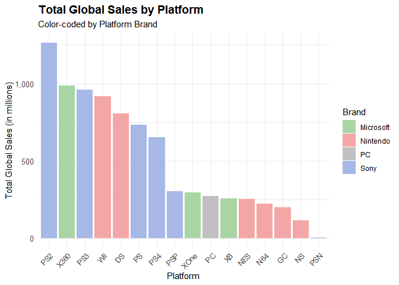<!-- -->

We’re looking at total global sales across platforms, so instead of
individual games, this is the sum of all game sales per platform. Right
away, you can see that the PlayStation 2 is the highest. It’s the most
successful platform globally, with over 1.25 billion units sold. After
the PlayStation 2, we see strong performance from XBox 360, the
PlayStation 3, Wii, and DS. The bars are color-coded by brand, blue for
Sony, green for Microsoft, red for Nintendo, and gray for PC, so we can
get a sense of which companies had the biggest impact. It’s also worth
noting that while Nintendo had some of the highest-selling individual
games, like Wii Sports, Sony had more overall success when you look at
total game sales across its platforms. So overall, this chart really
highlights how dominant Sony, especially with the the PlayStation 2

``` r
# Define company colors
company_colors <- c(
  "Nintendo"  = "#F4A6A6",  # Pastel red
  "Sony"      = "#A6B8E6",  # Pastel blue
  "Microsoft" = "#A9D6A4",  # Pastel green
  "PC"        = "#C0C0C0"   # Light gray
)

# Summarize and reshape data
platform_region_sales <- q1_data %>%
  group_by(Platform) %>%
  summarise(
    NA_Sales = sum(NA_Sales, na.rm = TRUE),
    PAL_Sales = sum(PAL_Sales, na.rm = TRUE),
    JP_Sales = sum(JP_Sales, na.rm = TRUE),
    Other_Sales = sum(Other_Sales, na.rm = TRUE)
  ) %>%
  pivot_longer(
    cols = c(NA_Sales, PAL_Sales, JP_Sales, Other_Sales),
    names_to = "Region",
    values_to = "Sales"
  ) %>%
  mutate(
    Region = recode(Region,
                    "NA_Sales" = "North America",
                    "PAL_Sales" = "Europe",
                    "JP_Sales" = "Japan",
                    "Other_Sales" = "Other"),
    Company = case_when(
      Platform %in% c("N64", "NS", "Wii", "DS", "NES", "GC") ~ "Nintendo",
      Platform %in% c("PS", "PS2", "PS3", "PS4", "PSP", "PSN") ~ "Sony",
      Platform %in% c("XB", "X360", "XOne") ~ "Microsoft",
      Platform == "PC" ~ "PC",
      TRUE ~ "Other"
    )
  ) %>%
  filter(Company != "Other")  # remove unknown brands

# Plot: Facet by Region, color by Company
ggplot(platform_region_sales, aes(x = reorder(Platform, -Sales), y = Sales, fill = Company)) +
  geom_col(show.legend = TRUE) +
  scale_fill_manual(values = company_colors) +
  facet_wrap(~ Region, scales = "free_y") +
  labs(
    title = "Platform Sales by Region",
    x = "Platform",
    y = "Total Sales (in millions)",
    fill = "Brand"
  ) +
  theme_minimal() +
  theme(
    axis.text.x = element_text(size = 10, angle = 60, hjust = 1, vjust = 1),
    strip.placement = "outside",
    strip.background = element_blank(),
    panel.spacing = unit(1.5, "lines"),
    plot.title = element_text(face = "bold", size = 16)
  )
```

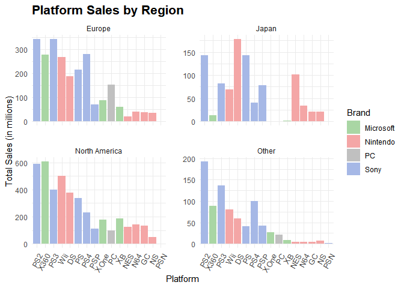<!-- -->

This breaks down platform sales by region, so we can see which consoles
were most popular in different parts of the world. Let’s start with
North America and Europe. You’ll notice the pattern is pretty similar in
both regions, the PlayStation 2 was popular, followed by Xbox 360,
PlayStation 3, and Wii. These were the go-to consoles during the peak
gaming years of the 2000s. In the “Other” category, which consists of
the rest of the world excluding Japan, we see the same top performers
again: PlayStation 2, Xbox 360, PlayStation 3, and also PlayStation 4.
But we should notice that things look very different in Japan. Here,
Nintendo dominates, especially with the DS and NES. The PlayStation 2 is
still in the most popular platforms, but Nintendo’s presence is much
stronger compared to the rest of the world. That really highlights
Japan’s different gaming culture and preference for handhelds and
classic titles. The chart is once again color-coded by brand, making it
easy spot which company led where. Overall, this comparison shows how
Sony had global dominance, but Nintendo remained incredibly strong in
Japan, with Microsoft’s biggest impact being in North America and
Europe. This led us into thinking why does Japan stands out so much, not
just in our data, but in the history of video games overall. As Blake
Harris puts it in his book Console Wars: “Without the contributions of
Japan, we wouldn’t have a video game industry.” That really sets the
tone for understanding Japan’s influence. Looking at the data, the top
platforms in Japan were the PlayStation 2, DS, standing for Dual Screen,
PlayStation, and NES, standing for Nintendo Entertainment System. All of
these consoles were created by Sony or Nintendo. Both of those companies
were founded in Japan, with Nintendo headquartered in Kyoto, and Sony
based in Tokyo. And according to CNN, Tokyo was the front leader for
gaming, with both Nintendo and Sony having deep roots there. That
historical presence helped shape Japan into a gaming powerhouse and
explains why platform sales are especially high there. So when we see
Japan’s platform preferences differ from other regions, it’s not random,
it reflects deep cultural ties, brand loyalty, and the fact that Japan
is a hub for gaming innovation.
<https://www.cnn.com/2017/11/12/asia/future-japan-videogame-landmarks/index.html>
As said by CNN, Tokyo was the front leader for gaming with SEGA and
Nintendo originating there. This explains the platforming being higher.

``` r
# Define brand colors
company_colors <- c(
  "Nintendo"  = "#F4A6A6",  # Pastel red
  "Sony"      = "#A6B8E6",  # Pastel blue
  "Microsoft" = "#A9D6A4",  # Pastel green
  "PC"        = "#C0C0C0"   # Light gray
)

# Add Company info to platform summary
q1_platform_avg_year <- q1_data %>%
  group_by(Platform, Year) %>%
  summarise(avg_sales = mean(Global_Sales, na.rm = TRUE)) %>%
  mutate(
    Company = case_when(
      Platform %in% c("N64", "NS", "Wii", "DS", "NES", "GC") ~ "Nintendo",
      Platform %in% c("PS", "PS2", "PS3", "PS4", "PSP", "PSN") ~ "Sony",
      Platform %in% c("XB", "X360", "XOne") ~ "Microsoft",
      Platform == "PC" ~ "PC",
      TRUE ~ "Other"
    )
  ) %>%
  filter(Company != "Other") %>%
  arrange(desc(avg_sales))
```

    ## `summarise()` has grouped output by 'Platform'. You can override using the
    ## `.groups` argument.

``` r
q1_platform_avg_year %>%
  filter(Year > 2000) %>%
  ggplot(aes(x = Year, y = avg_sales)) +
  geom_col() +
  facet_wrap(~Platform) +
  labs(
    title = "Average Genre Sales by Year (After 2000)",
    x = "Year",
    y = "Global Sales (in millions)"
  ) +
  theme(
    axis.text.x = element_text(angle = 45, hjust = 1),
    axis.title.x = element_text(margin = margin(t = 10))
  ) +
  scale_y_continuous(labels = scales::comma)
```

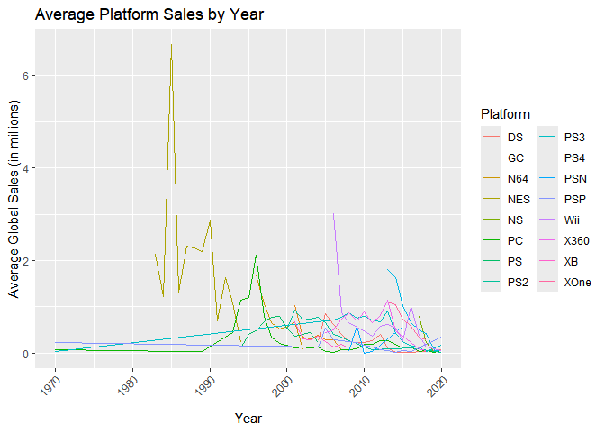<!-- -->

## Conclusion

1.  The genre with the best sales is Sports, highlighting its popularity
    among players worldwide.

2.  There is a positive but not particularly strong relationship between
    both user and critic ratings and global sales. Higher scores
    generally align with better sales, but other variables clearly play
    a role. A moderate/strong relationship exists between critic ratings
    and global sales, suggesting their importance as a marker for
    potential bestsellers. This may indicate that critic ratings carry
    more weight or visibility in influencing purchasing decisions.

3.  The most successful platform in terms of global sales is PS2.

4.  X-Box is home to games with the best average ratings, solidifying
    its reputation for quality.

5.  While X-Box has the best average rating, Nintendo has the best sales
    according to this data. The NES and Wii have the highest Q3 of
    Global Sales, with Wii having the most successful game.

6.  We can see the rise of video games in the 2000’s with it peaking
    around 2009. From there it gently declines with a sharp decrease
    in 2020. Was this because of data collection and a bias within the
    data, or for actual reasons? Perhaps the pandemic has caused a
    decline in sales recently.

7.  This further shows the popularity of the sports genre, as it is the
    genre with the highest number of sales in all of the genres. Close
    behind, Shooter and Action are also very popular.

8.  While most areas, such as North America, follow the same pattern
    with Action, Shooter, and Sports being the top 3 games, JP follows a
    different trend. JP stands for Japan. Japan’s top performing genres
    are Platform, Role-Playing, and Sports. Role-Playing being the
    significantly most popular game genre. This shows the cultural
    difference between the Americas and Japan.

### Further Questions

A few questions we’d like to explore in the future:

1.  How do digital-only games compare to physical releases in terms of
    both sales and ratings? As digital distribution grows, this could
    reveal important changes in consumer behavior.
2.  What role do major game franchises play in driving platform success?
    For example, how much do flagship titles like Call of Duty or Mario
    influence console popularity?
3.  Are strong marketing campaigns or optimal release timing more
    influential on sales than ratings alone? This would help us
    understand if visibility can sometimes outweigh quality in
    determining success.
4.  How has the rise of mobile and indie games shifted genre trends over
    time? These newer segments may be reshaping the industry in ways
    that traditional data doesn’t fully capture yet.

These questions could offer deeper insights into how the video game
landscape continues to evolve.
